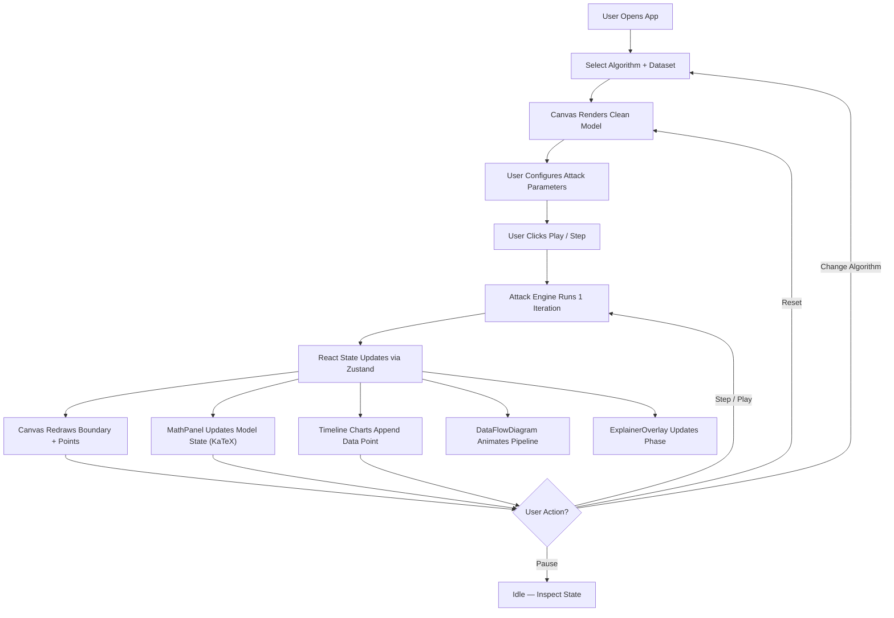
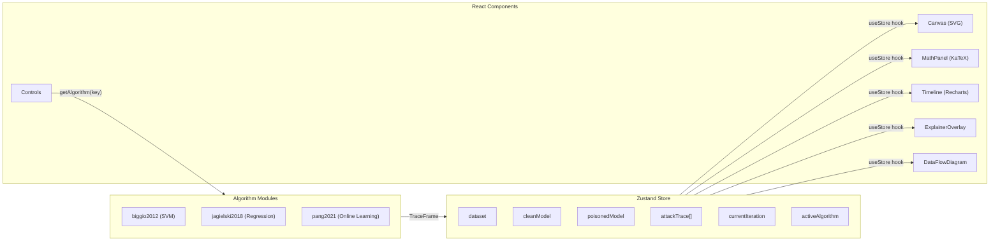

# Architecture — ML Security Attack Visualizer

## 1. App Flow and Architecture

### High-Level Flow



### State Management



---

## 2. Folder and File Structure

```
ml-security-viz/
├── package.json
├── next.config.ts
├── tsconfig.json
│
├── public/
│   └── favicon.svg
│
├── src/
│   ├── app/
│   │   ├── layout.tsx              # Root layout — fonts, metadata, global CSS
│   │   ├── page.tsx                # Main page — assembles all panels
│   │   └── globals.css             # Design tokens (Tailwind v4 @theme), resets
│   │
│   ├── components/
│   │   ├── AppHeader.tsx           # Top navigation bar
│   │   ├── Canvas.tsx              # SVG scatter + decision boundary / regression
│   │   ├── ControlPanel.tsx        # Left sidebar — dynamic config from AlgorithmModule
│   │   ├── MathPanel.tsx           # Right sidebar — model state inspector (KaTeX)
│   │   ├── PlaybackBar.tsx         # Play / Pause / Step / Reset controls
│   │   ├── Timeline.tsx            # Loss/error charts (Recharts)
│   │   ├── PointInspector.tsx      # Floating per-point math details
│   │   ├── ComparisonTable.tsx     # Clean vs Poisoned metrics table
│   │   ├── GuidedTour.tsx          # Algorithm walk-through helper
│   │   ├── TutorialModal.tsx       # First-time onboarding overlay
│   │   ├── ExplainerOverlay.tsx    # ★ Transformer Explainer-style step cards
│   │   ├── DataFlowDiagram.tsx     # ★ Animated SVG data pipeline
│   │   ├── MathEq.tsx              # KaTeX wrapper with tooltips
│   │   ├── ContourField.tsx        # Background contour SVG pattern
│   │   ├── Reticle.tsx             # Crosshair SVG icon
│   │   ├── InverseImagePanel.tsx   # MNIST inverse visualization
│   │   ├── PoisonImagePanel.tsx    # Poison image transformation
│   │   ├── TestImagePanel.tsx      # Clean vs Poisoned test image
│   │   ├── ExplainerCard.tsx       # Concept explainer popover
│   │   └── ExplainerIcon.tsx       # Explainer trigger icon
│   │
│   ├── engine/
│   │   ├── architectures/          # ★ Plugin-based algorithm modules
│   │   │   ├── registry.ts         # AlgorithmModule interface + registry
│   │   │   ├── index.ts            # Barrel — imports all algorithms
│   │   │   ├── README.md           # ★ How to add a new algorithm
│   │   │   ├── biggio2012/         # SVM Poisoning (Biggio et al. 2012)
│   │   │   │   ├── index.ts        # Registration + configSchema
│   │   │   │   ├── model.ts        # SMO SVM solver
│   │   │   │   ├── attack.ts       # Gradient ascent poisoning
│   │   │   │   └── kernels.ts      # Linear, RBF, Polynomial
│   │   │   ├── jagielski2018/      # Regression Poisoning (Jagielski et al. 2018)
│   │   │   │   ├── index.ts        # Registration + configSchema
│   │   │   │   ├── model.ts        # Ridge, LASSO, OLS
│   │   │   │   └── attack.ts       # KKT implicit differentiation
│   │   │   └── pang2021/           # ★ Accumulative Poisoning (Pang et al. 2021)
│   │   │       ├── index.ts        # Registration + configSchema
│   │   │       ├── model.ts        # Logistic regression + SGD
│   │   │       ├── attack.ts       # Two-phase: accumulate + trigger
│   │   │       ├── gradient.ts     # PGD perturbation computation
│   │   │       └── explainer.ts    # Step-by-step explanation cards
│   │   ├── data/
│   │   │   ├── datasets.ts         # Dataset generators + registry
│   │   │   ├── raw/                # Static JSON datasets
│   │   │   └── loaders/            # MNIST, CSV, etc.
│   │   ├── ui/
│   │   │   └── explainers.tsx      # Concept explainer definitions
│   │   ├── linalg.ts               # Matrix ops (zero dependencies)
│   │   ├── metrics.ts              # Accuracy, Precision, Recall, F1
│   │   └── worker.ts               # Web Worker entry
│   │
│   ├── store/
│   │   └── useStore.ts             # Zustand store — single source of truth
│   │
│   └── hooks/                      # (Future: custom hooks)
│
└── docs/
    ├── prd.md
    ├── architecture.md             # (this file)
    ├── rules.md
    ├── phases.md
    ├── design.md
    └── memory.md
```

---

## 3. Tech Stack

| Layer | Choice | Rationale |
|---|---|---|
| **Framework** | Next.js 16 (App Router) | Modern React, SSR, optimized builds |
| **UI Library** | React 19 | Hooks, concurrent rendering |
| **Styling** | Tailwind CSS v4 (`@theme`) | CSS-based config, design tokens |
| **State** | Zustand | Lightweight, hook-based, no boilerplate |
| **Charts** | Recharts | React-native, built on D3 |
| **Math Rendering** | KaTeX | Fast LaTeX rendering |
| **Linear Algebra** | Custom `linalg.ts` | Small, focused, zero deps |
| **Fonts** | Inter, JetBrains Mono (next/font) | Optimized loading |

### No Backend Required

All computation is client-side. Each algorithm's attack runs in pure TypeScript inside the main thread (with `setTimeout` for yielding). Next.js is used purely for its frontend capabilities.

---

## 4. Algorithm Registry Pattern

The `AlgorithmModule` interface in `registry.ts` defines the contract every attack module must satisfy:

```typescript
interface AlgorithmModule {
  key: string;                    // Unique ID: 'biggio2012', 'pang2021', etc.
  name: string;                   // Display name
  paper: string;                  // Paper URL
  paperShort: string;             // "Author et al. Year"
  modelType: 'classification' | 'regression';
  configSchema: ConfigField[];    // Drives ControlPanel dynamically
  defaultConfig: Record<string, any>;
  datasets: string[];             // Compatible dataset keys
  trainClean(dataset, config): { modelState, rawModel };
  runAttack(dataset, cleanState, config, onProgress, onComplete, onError): void;
  predict(rawModel, x): number;
  explainerSteps?: ExplainerStep[]; // Optional: guided learning cards
}
```

Adding a new algorithm requires:
1. Create a folder under `src/engine/architectures/<paper_key>/`
2. Implement `model.ts`, `attack.ts`, and `index.ts`
3. Call `registerAlgorithm(module)` in `index.ts`
4. Add `import './<paper_key>'` to `architectures/index.ts`

See `src/engine/architectures/README.md` for full instructions.

---

## 5. TraceFrame Schema

Every algorithm emits `TraceFrame` objects during attack execution:

```typescript
interface TraceFrame {
  iteration: number;
  poisonX: number[][];           // Current poison point positions
  poisonY: number[];             // Poison labels
  poisonedModel: any;            // Display-friendly state
  poisonedRawModel: any;         // Raw model for prediction
  objectiveValue: number;        // Attacker's objective
  gradients: number[][];         // Per-point gradients
  gradientNorms: number[];       // Per-point gradient magnitudes
  deltaW: number;                // ‖θ_poisoned - θ_clean‖

  // Optional classification fields
  poisonedAccuracy?: number;
  cleanAccuracy?: number;

  // Optional regression fields
  poisonedMSE?: number;
  cleanMSE?: number;

  // Online learning fields (Pang 2021)
  phase?: 'accumulative' | 'trigger' | 'baseline';
  batchIndex?: number;
  perturbationNorm?: number;
  secretAccuracy?: number;
  triggerLoss?: number;
  accumulatedDrift?: number;
}
```
