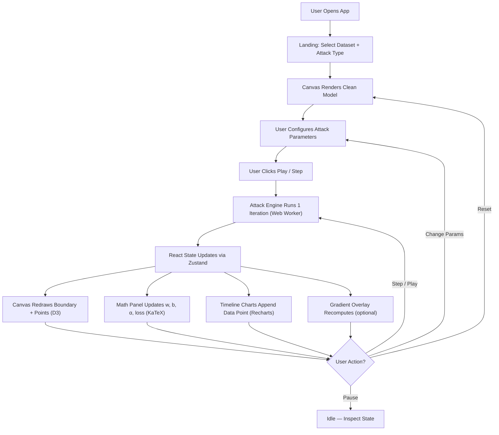
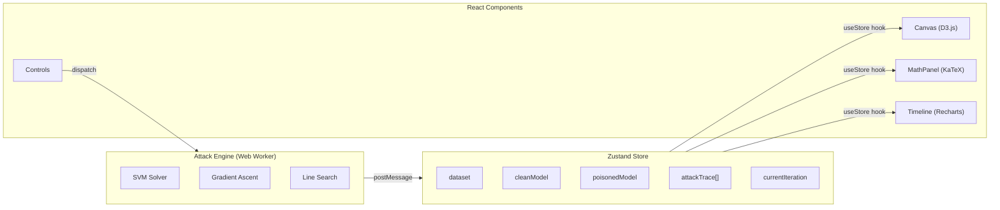

# Architecture — ML Security Attack Visualizer

## 1. App Flow and Architecture

### High-Level Flow



### State Management



The attack engine runs inside a **Web Worker** so heavy matrix math never blocks the UI thread. State updates are emitted via `postMessage` and dispatched through Zustand.

---

## 2. Folder and File Structure

```
ml-security-viz/
├── package.json
├── next.config.mjs
├── tsconfig.json (optional — using JS)
│
├── public/
│   └── favicon.svg
│
├── src/
│   ├── app/
│   │   ├── layout.js              # Root layout — fonts, metadata, global CSS
│   │   ├── page.js                # Main page — assembles all panels
│   │   └── globals.css            # Global design tokens, resets, typography
│   │
│   ├── components/
│   │   ├── AppHeader.js           # Top navigation bar
│   │   ├── AppHeader.module.css
│   │   ├── Canvas.js              # D3-based scatter + decision boundary
│   │   ├── Canvas.module.css
│   │   ├── ControlPanel.js        # Left sidebar — dataset, kernel, attack params
│   │   ├── ControlPanel.module.css
│   │   ├── MathPanel.js           # Right sidebar — math state inspector
│   │   ├── MathPanel.module.css
│   │   ├── PlaybackBar.js         # Play/Pause/Step controls + metrics
│   │   ├── PlaybackBar.module.css
│   │   ├── Timeline.js            # Loss/error charts (Recharts)
│   │   ├── Timeline.module.css
│   │   ├── DatasetChip.js         # Dataset selector chip
│   │   └── MetricCard.js          # Reusable metric display card
│   │
│   ├── engine/
│   │   ├── worker.js              # Web Worker entry — receives commands
│   │   ├── svm.js                 # SVM solver (SMO algorithm)
│   │   ├── poisoning.js           # Gradient-ascent poisoning (Biggio 2012)
│   │   ├── kernels.js             # Kernel functions (linear, RBF, poly)
│   │   ├── linalg.js              # Matrix ops (zero dependencies)
│   │   └── datasets.js            # Built-in dataset generators
│   │
│   ├── store/
│   │   └── useStore.js            # Zustand store — single source of truth
│   │
│   ├── hooks/
│   │   ├── useWorker.js           # Web Worker lifecycle hook
│   │   └── usePlayback.js         # Auto-play / step-through logic
│   │
│   └── utils/
│       ├── colorScale.js          # Color palette utilities
│       ├── mathFormat.js          # Number formatting for display
│       └── exportUtils.js         # PNG / SVG / JSON export
│
└── docs/
    ├── prd.md
    ├── architecture.md
    ├── rules.md
    ├── phases.md
    ├── design.md
    └── memory.md
```

---

## 3. Tech Stack

| Layer | Choice | Rationale |
|---|---|---|
| **Framework** | Next.js 15 (App Router) | Modern React framework with built-in routing, SSR, and optimized builds |
| **UI Library** | React 19 | Component-based architecture; hooks for state and side effects |
| **Styling** | CSS Modules + globals.css | Scoped styles per component; global design tokens via custom properties |
| **State** | Zustand | Lightweight, hook-based store; no boilerplate like Redux |
| **Visualization** | D3.js v7 | Scatter plots, contour rendering, vector fields — used imperatively via `useRef` |
| **Charts** | Recharts | React-native charting library built on D3; great for timeline panels |
| **Math Rendering** | KaTeX + react-katex | Fast LaTeX rendering in React components |
| **Heavy Compute** | Web Workers | Run SVM solver and gradient ascent off the main thread |
| **Linear Algebra** | Custom `linalg.js` | Small, focused matrix operations for 2D problems |
| **Fonts** | next/font (Inter, JetBrains Mono) | Optimized font loading via Next.js |
| **Package Manager** | npm | Standard Node.js package management |

### Key Dependencies

```json
{
  "dependencies": {
    "next": "^15",
    "react": "^19",
    "react-dom": "^19",
    "zustand": "^5",
    "d3": "^7",
    "recharts": "^2",
    "katex": "^0.16",
    "react-katex": "^3"
  }
}
```

### No Backend Required

All computation is client-side. The SVM solver and poisoning attack run in pure JavaScript inside a Web Worker. Next.js is used purely for its frontend capabilities:

- Optimized builds and code splitting
- CSS Modules for scoped styling
- Font optimization
- Easy deployment to Vercel / GitHub Pages
- Hot module replacement during development
